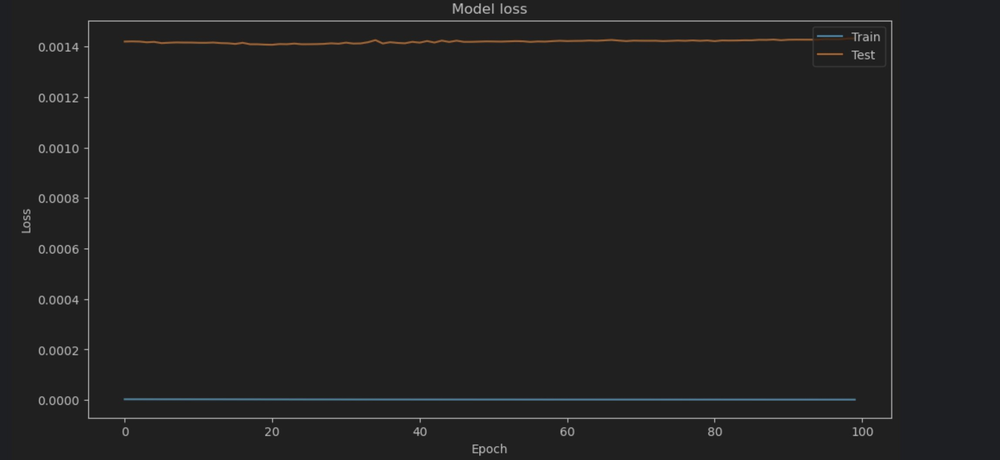

# Car Prediction and Testing Project
## Overview
This repository contains the project files for analyzing and predicting car data. The project involves using machine learning techniques to predict various aspects related to cars, such as prices, performance, and specifications.

The files included in this project are as follows:
1. [Data Cleaning](https://github.com/yourusername/yourprojectname/blob/master/Data%20Cleaning.py) - This Python script includes the initial data processing steps such as handling missing values, normalizing data, and preparing it for further analysis.
2. [Exploratory data Analysis](https://github.com/yourusername/yourprojectname/blob/master/Untitled1.py) - This script is used for feature extraction and engineering, as well as initial testing of machine learning models.
3. [Car Prediction and Testing](https://github.com/yourusername/yourprojectname/blob/master/car%20prediction%20and%20testing.ipynb) - This Jupyter notebook contains the detailed analysis, model training, and predictions using various machine learning models.

## Dataset
The dataset used for this project can be found [here]([https://linktodataset.com](https://www.kaggle.com/datasets/aishwaryamuthukumar/cars-dataset-audi-bmw-ford-hyundai-skoda-vw)). It contains various features of cars, including make, model, year, specifications, and price, which are used to train our predictive models.

## Methodology
### Data Cleaning
The dataset contains numerous features, which include both numerical and categorical data. This step involves:
- Cleaning NaN or invalid data entries
- Normalizing data scales
- Encoding categorical data for model compatibility

### Exploratory Data Analysis
After cleaning, we perform exploratory data analysis on our cleaned data set to find correlation between the variables:
- Correlation HeatMap which shows the high or low positive or negative correlation
- Pairplot to show and analyze the correlation between different variables
- Finding the major variables of the dataset which have highest correlation

### Car Prediction and Testing
Machine learning models tested in this phase:
- Autoencoder which is a type of neural networks is applied to predict car prices and specifications
- Hyperparameter tuning is conducted to optimize model performance
- Model performance is evaluated based on metrics like RMSE, MAE, and R-squared

## Results
This table denotes performance statistics for the models:

| Accuracy       |      MSE      |
| :---           |          ---: |
|   99.970045%   |    0.000299   |

**This graph tells us the loss in accuracy in testing and training data. The graph shows that the test data has a loss of 0.0014 giving us an accuracy of approximately 99.9986.**  
**In general terms, if model is overfitting then training loss continues to decrease while validation loss starts to increase and if model is underfitting then both training and validation loss will be high.**

## Conclusion
In conclusion, we found that it is possible to recommend car listings with relatively high accuracy (>99%), despite the highly imbalanced parameter. More importantly, our model is able to hit almost 100% accuracy with recommending cars, which is important as creating a model that inaccurately recommends cars which are not according to the users preference.
## Contributors
@samjam2005- Model Development, Data cleaning, EDA  
@ - Model Development, Data Cleaning, EDA  
@Himanshu492 - Model Development, Data Cleaning, EDA  

## References
- Goodfellow, Ian, et al. "Deep Learning." MIT Press, 2016. link
- Chollet François, "Deep Learning with Python," Manning Publications, 2017.
- TensorFlow Keras API documentation: https://www.tensorflow.org/api_docs/python/tf/keras
- Scikit-learn documentation: https://scikit-learn.org
